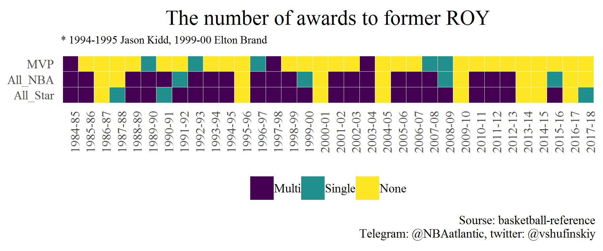
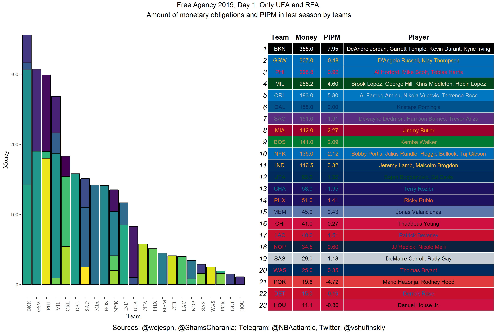

```{r setup, include=FALSE}
knitr::opts_chunk$set(echo = TRUE)
```

## Проекты, созданные для Телеграм-канала NBAatlantic в июне-июле

### Анализ количества наград у бывших Rookie of the Year
Анализ "успешности" карьеры бывших новичков года в плане наград в дальнейшем. Выбраны три их вида: поездка на All-Star, попадание в All-NBA команды и титул MVP.

```{r, warning=FALSE, message=FALSE}
library(data.table)
library(tidyverse)
library(ggthemes)
dt <- fread("F:/Excel/NBAatlantic/ROY.csv")
knitr::kable(dt[1:10])
```

Точное количество наград я заменяю категориальной переменной к тремя значениями: None, Single, Multi. Замену првоодится с помощью функции ```replase_func```.

```{r, results='hide', echo=FALSE}
dt1 <- copy(dt)
dt1 <- dt1[, Player := str_remove(Player, "\\\\[:alnum:]{1,}")]
```

```{r}
## Функция для замены числовых значений категориальными
replase_func <- function(x){
  if_else(x == 0, "None",
          if_else(x == 1, "Single",
                  if_else(x > 1, "Multi", "NA")))
}
cols <- colnames(dt1[, 3:5])
dt1 <- dt1[, (cols) := lapply(.SD, replase_func), .SDcols = cols]
knitr::kable(dt1[1:5])
```

Изменение вида данных с помощью функции ```melt```
```{r}
dt1 <- melt(dt1, measure.vars = cols, variable.name = "Awards", value.name = "Count")
knitr::kable(dt1[1:5])
```{r, results='hide', echo=FALSE}
dt1 <- dt1[, Count := factor(Count, levels = c("Multi", "Single", "None"))]
```

Построение графика

```{r}
ggplot(dt1, aes(x = Season, y = Awards, fill = Count)) +
  geom_tile(color = "white", size = 0.1) +
  scale_fill_viridis_d(option = "viridis") +
  coord_equal() +
  theme_tufte() +
  labs(title = "The number of awards to former ROY",
       subtitle = "* 1994-1995 Jason Kidd, 1999-00 Elton Brand",
       caption = "Sourse: basketball-reference\n Telegram: @NBAatlantic, twitter: @vshufinskiy") +
  theme(axis.title = element_blank(),
        axis.text.x = element_text(angle = 90),
        legend.position = "bottom",
        plot.title = element_text(hjust = 0.5, size = 15),
        plot.subtitle = element_text(size = 8),
        axis.ticks = element_blank(),
        legend.title = element_blank())
```

### Анализ стоимости и продуктивности игроков, подписанных в первый день рынка свободных агентов.

```{r, message=FALSE}
library(data.table)
library(tidyverse)
library(ggthemes)
library(grid)
library(gridExtra)

fa <- fread("F:/NBA_20191705/Excel/BBindex/FA_PIPM.csv")
pipm <- fread("C:/Users/1170201i3/Desktop/2018-19 PIPM & Multi-Year PIPM - 2018-19 PIPM.csv")
color <- fread("F:/NBA_20191705/Excel/Team_color.csv")
```

```{r, echo=FALSE}
## Удаление лишних столбцов из таблицы pipm
pipm <- pipm[, .(Player, PIPM)]
## Объединение таблиц и изменение значений NA на 0
table <- merge(fa, pipm, by = "Player", all.x = T)
table[is.na(table)] <- 0
```

Сворачивание таблицы из "long" в "wild", объединение столбцов и удаление элементов NA.

```{r}
test <- dcast(table, Team ~ Player, value.var = "Player")
test <- test[, .(Team, Player = do.call(paste, c(.SD, sep = ", "))), .SDcols = 2:45][
  , Player := str_remove_all(Player, "(NA, )|(, NA)")]
knitr::kable(test[1:5])
```

Суммирование стоимости контрактов и показателя PIPM по командам и объединение с таблицей test.
```{r}
table1 <- table[, .(Money = sum(Money),
                    PIPM = sum(PIPM)), by = Team]
table1 <- merge(table1, test, by = "Team")
table1 <- table1[order(Money, decreasing = T)]
knitr::kable(table1[1:5])
```

```{r}
## Создание символьного вектора с названием команд с порядке убывания их затрат
factor <- table1[order(Money, decreasing = T)][,Team]
## Объединение таблицы с данными и таблицы с цветом, сортировка по убыванию
table_color <- merge(table1, color, by.x = "Team", by.y = "TEAM_ABBREVIATION")
table_color <- table_color[, .(Team, col1, col2)]
table_color <- merge(table_color, table1)
table_color <- table_color[order(Money, decreasing = T)]
## Изменение типа данных столбца Team на фактор.
table2 <- table[, Team := factor(Team, levels = factor)]
```
Создание графика и таблицы и их объединение с помощью функции ```grid.arrange```

```{r, eval =FALSE}
## Создание графика
gg <- ggplot(table2, aes(x = Team, y = Money)) +
  geom_bar(stat = "identity", aes(fill = Player), color = "black") +
  scale_fill_viridis_d() +
  theme_tufte()+
  theme(legend.position = "none",
        axis.text.x = element_text(angle = 90)) 
## Создание темы для таблицы. Добавление цвета заливки и текста
theme <- ttheme_minimal(
  core = list(bg_params = list(fill = table_color$col1, col = "white"),
              fg_params = list(col = table_color$col2, cex = 0.8))
)
## Создание таблицы
gtable <- tableGrob(table1, theme = theme)
## Объединение графика и таблицы, добавление заголовка и подписи.
output <- grid.arrange(gg, gtable, nrow = 1, 
                       top = textGrob("Free Agency 2019, Day 1. Only UFA and RFA.\nAmount of monetary obligations and PIPM in last season by teams",
                                      hjust = 0.5),
                       bottom = textGrob("Sources: @wojespn, @ShamsCharania; Telegram: @NBAatlantic, Twitter: @vshufinskiy"))
```

Конечный график



Мои работы можно посмотреть в Телеграм-канале [NBAatlantic](https://t.me/nbaatlantic)
